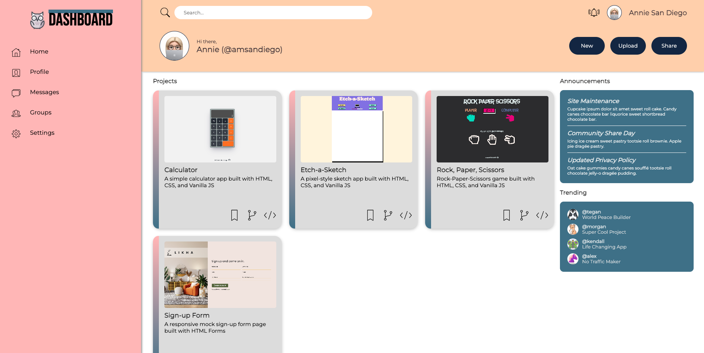

# The Odin Project - Admin Dashboard

This is a solution to the Admin Dashboard Project on [The Odin Project](https://www.theodinproject.com/lessons/node-path-intermediate-html-and-css-admin-dashboard).

## Table of contents

- [Overview](#overview)
  - [Screenshot](#screenshot)
  - [Links](#links)
- [My process](#my-process)
  - [Built with](#built-with)
  - [What I learned](#what-i-learned)
  - [Continued development](#continued-development)
  - [Useful resources](#useful-resources)
- [Author](#author)

## Overview

### Screenshot

### Links

- Solution URL: [https://github.com/amsandiego/odin-dashboard](https://github.com/amsandiego/odin-dashboard)
- Live Site URL: [https://amsandiego.github.io/odin-dashboard](https://amsandiego.github.io/odin-dashboard)

## My process

### Built with

- Semantic HTML markup
- CSS Grid
- CSS Flexbox

### What I learned

- When to use Grid and when to use Flex

### Continued development

- Mobile responsiveness

### Useful resources

- [How can I add a box-shadow on one side of an element](https://stackoverflow.com/questions/5115427/how-can-i-add-a-box-shadow-on-one-side-of-an-element) This helped me create a one-sided box-shadow for the sidebar.
- [A Complete Guide to CSS Grid](https://css-tricks.com/snippets/css/complete-guide-grid/) A useful cheat sheet for all things grid

## Author

- GitHub - [amsandiego](https://github.com/amsandiego)
